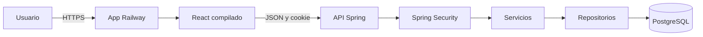
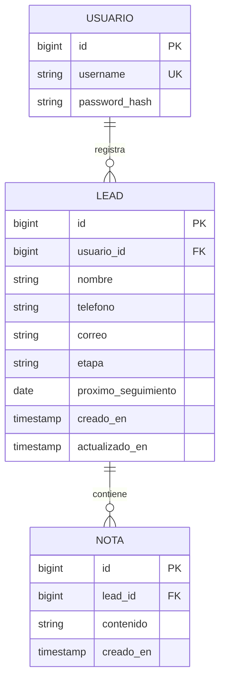

# Arquitectura y seguridad

UrLeads será una aplicación web de una sola unidad desplegable, con frontend
React y backend Spring Boot. En producción Spring servirá los archivos del
frontend y la API desde una misma URL.

## Tecnologías previstas

| Capa | Elección | Motivo |
|---|---|---|
| Frontend | React, TypeScript y Vite | El equipo ya conoce React y obtiene tipado y build rápido. |
| UI | Tailwind CSS y shadcn/ui | Sistema visual consistente y componentes accesibles. |
| Rutas | React Router | Rutas públicas y privadas del dashboard. |
| Datos remotos | TanStack Query y `fetch` | Estados de carga/error e invalidación tras mutaciones. |
| Backend | Java 21 y Spring Boot | Requisito y objetivo del curso. |
| API | Spring MVC | Controladores REST y manejo de HTTP. |
| Persistencia | Spring Data JPA y PostgreSQL | Persistencia relacional exigida/recomendada. |
| Seguridad | Spring Security y BCryptPasswordEncoder | Login, protección de rutas y hash de contraseña. |
| Validación | Bean Validation | Restricciones en DTO de entrada. |
| Migraciones | Flyway | Cambios de esquema versionados. |
| Build Java | Maven Wrapper | Build reproducible en los equipos. |
| Tests | JUnit, Spring Boot Test y MockMvc | Pruebas unitarias y de integración. |
| Entorno local | Docker Compose para PostgreSQL | Base local uniforme, sin depender de nube durante desarrollo. |
| CI | GitHub Actions | Ejecutar tests, lint y builds en pull requests. |
| Producción | Railway | App y PostgreSQL gestionados. |

Las versiones exactas se fijarán al implementar, comprobando compatibilidad con
Java 21 y el curso. React no requiere Next.js para este dashboard privado: Spring
será el servidor y proveedor de la API.

## Vista de componentes

## Modelo de datos

## Capas del backend

Los controladores reciben y devuelven DTO. Los servicios aplican reglas de
negocio. Los repositorios consultan entidades JPA. Las entidades no se devuelven
directamente al frontend. Configuración y secretos entran por variables de
entorno, nunca se guardan en Git.

## Autenticación y seguridad

- Sesión de Spring Security con cookie HttpOnly; Secure en producción y
  `SameSite` apropiado.
- Se conserva protección CSRF. El frontend y Postman obtienen el token desde
  `/api/auth/csrf` y lo envían en las solicitudes que modifican estado.
- Login rota el identificador de sesión; logout invalida la sesión.
- No guardar tokens de sesión en `localStorage` ni implementar criptografía
  propia.
- Hash con `BCryptPasswordEncoder`; el hash nunca se devuelve por la API.
- Las consultas restringen leads al usuario autenticado.
- Respuestas de error no exponen trazas ni secretos.
- Un único usuario de producto no significa eliminar la asociación de dueño:
  esta evita acceso cruzado accidental y permite ampliar el sistema más adelante.

## Decisiones de despliegue

Railway alojará dos servicios: la aplicación Spring Boot y PostgreSQL. La base
no tendrá acceso público si la plataforma permite conexión privada. La
aplicación respetará el puerto asignado, contará con healthcheck y persistencia
de PostgreSQL. No se añaden microservicios, Kubernetes, Redis ni procesos Node
en producción.
